Follow the steps below to start a single-node Wanchain private chain locally.

*Note: The current version of Wanchain private chain supports evmVersion up to Byzantium, and Solidity version up to 0.8.10. You need to manually set evmVersion to Byzantium for compiling when your solidity version is greater than 0.4.26.*

## 1. Download Gwan

Go to Wanchain Github channel to download the latest go-wanchain binary file:

https://github.com/wanchain/go-wanchain/releases

Please download the correct file according to your local operating system.

You will have an executable file of Gwan after you unzip the downloaded file.

Get the default testing keystore account by click the following URL:

https://raw.githubusercontent.com/wanchain/go-wanchain/develop/bootnode/UTC-2017-05-14T03-13-33.929385593Z-2d0e7c0813a51d3bd1d08246af2a8a7a57d8922e

You can see a json string on your browser after opening the URL above. Save the info to a file locally by "Ctrl+S".

Or, you can use the wget command scripts to get a keystore file beginning with letters UTC, and the wallet address is: 0x2d0e7c0813a51d3bd1d08246af2a8a7a57d8922e.

Save the keystore file to the path `[datadir]/keystore/`, where `[datadir]` is the default data storage directory.

The default value of the private chain is:

~/.wanchain/pluto (linux)

~/Library/Wanchain/pluto (MacOS)

## 2. Create A File With Default Password

Create a pw.txt file. The content of password is Wanchain.

Or, you can use the following scripts to generate this password file in the home directory:


`echo 'Wanchain' > ~/pw.txt`


## 3. Launch the Wanchain Private Chain

Use the following scripts to start the private chain node. Detailed parameters can be obtained from `gwan --help`.

The `--plutodev` in the command below means a private chain, and `--nodiscover` means the turn-off of P2P discovery. The path followed by `--password` parameter is the directory where the pw.txt file is located.

```
./gwan --plutodev --nodiscover --etherbase "0x2d0e7c0813a51d3bd1d08246af2a8a7a57d8922e" --unlock "0x2d0e7c0813a51d3bd1d08246af2a8a7anet57d8922e" --password ~/pw.txt --mine --minerthreads,debug --rethpc --minerthreads=1 --rethpc ,web3,personal,txpool,pos' --rpccorsdomain "*"
```

## 4. Connect Private Chain Node Using MetaMask

The parameters of connecting the local private chain node by MetaMask are as follows:


* RPC URL: http://127.0.0.1:8545

* Chain ID: 6

* Symbol: WAN

## 5. Connect Private Chain Node Using Remix

If you want to use Remix to link the local private chain node, you should choose Web 3 Provider and enter http://127.0.0.1:8545 on the DEPLOY page. After that you will see the default unlock address.

## 6. How to Use Remix To Deploy And Debug Smart Contracts Written By Solidity

### 6.1 Overview

Remix is the Solidity development IDE officially developed by Ethereum and runs on web pages. The URL is: https://remix.ethereum.org/

The main advantages of Remix over truffle include:
- Remix is developed by the official team of Ethereum and has the best compatibility with Solidity and Ethereum browsers;
- It is a visualized tool together with easy to deploy, read and write contracts;
- It can be linked to MetaMask wallet. It supports the hardware wallets such as Ledger, and it can flexibly switch between different chains;
- The deployed contracts can be linked to perform the operations of read and write online;
- Support a variety of extension plug-ins, which can debug transactions visually;

The main disadvantages of Remix compared to truffle include:
- It has high requirements for network status, and it is inconvenient to use when the network is unstable;

### 6.2 Quick Start

The interface after opening remix is as follows:

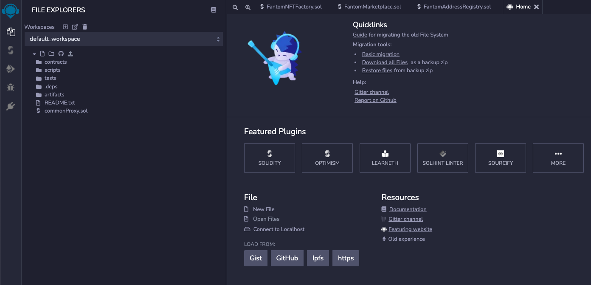

When you open Remix for the first time, you can see the samples of *.sol file it provides.

Click in the left panel to open the code file in the right window.

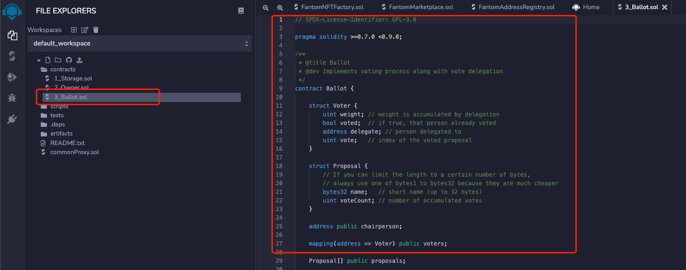

When you press Ctrl+S for saving, the compilation will be triggered automatically.

When an error occurs in the compilation, the error contents will be displayed on the compilation page, and an error message will be displayed in the corresponding line of the code:

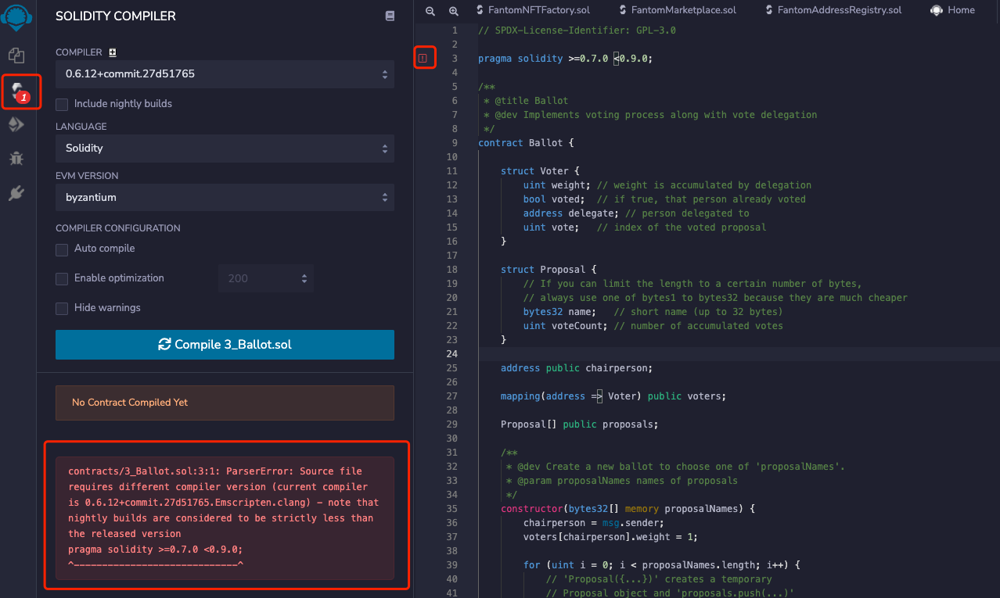

By default, Remix will only compile files opened in the current window (and its dependent files) rather than all files.

In the compilation window, you can select the required Solidity version and the corresponding EVM version, as well as others such as the optimization option.

When the Compiler version is switched, the corresponding compiled kernel will be automatically downloaded and compiled from the network when it is used for the first time.

This step may take from 10 seconds to a few minutes depending on the network status.

When the compiled kernel is downloaded, it generally takes only a few seconds to compile the sol file.

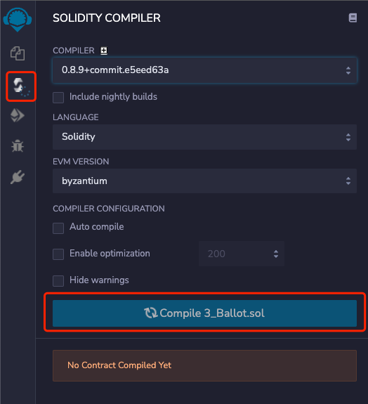

After the compilation is successful, the details of the contracts will be displayed.

You can switch between different sub-contracts to view the details of each.

You can easily get the contract ABI, contract function hash, and other contract information.

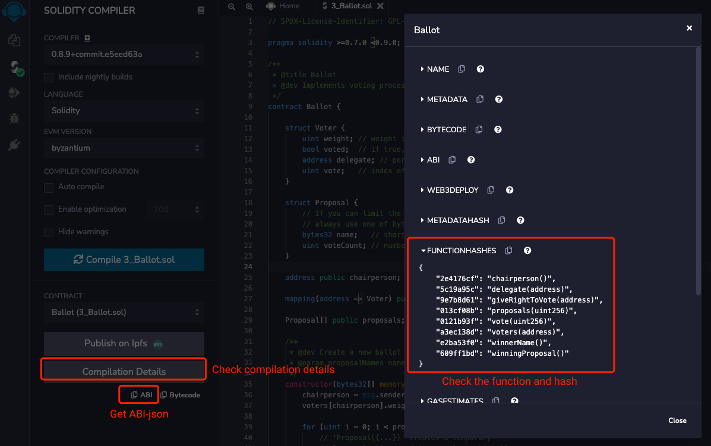

Click to switch to the contract deployment panel to deploy the contract.

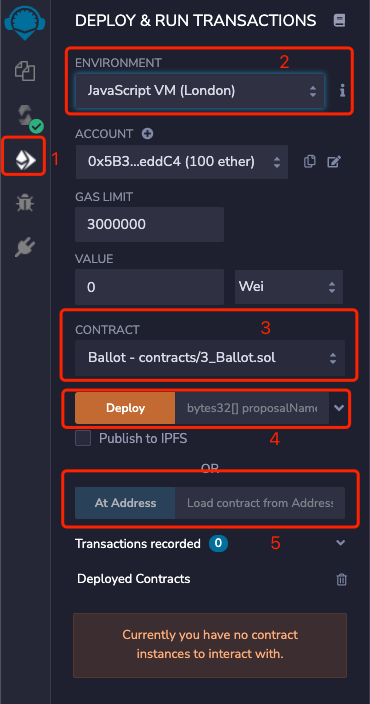

As shown in the figure above, where:
(1) Deployment page;

(2) You can choose different wallets or networks. The default JavaScript VM is an evm node simulator built into the browser, which can simulate the deployment and execution of contracts.

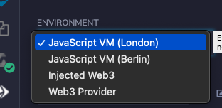

Select Injected Web3 in the drop-down list to connect to MetaMask wallet, and Web3 Provider can use a custom RPC address.

By choosing the MetaMask wallet, you can easily link to different blockchain networks, including the main network and the test network. Meanwhile, it also supports hardware wallets.

(3) Select the contract you want to deploy. In general, a sol file contains multiple contracts and interfaces, so you must **selecte them correctly** when deploying.

(4) Deployment: the parameters passed in by the constructor of the contract can be filled in on the right, and arrows can be expanded.

(5) Linking to the current deployed contract address. When you configure the existing contract, you should use this button. Fill in the contract address on the right.

After the contract is deployed or loaded, you can interact with the contract, as shown in the following figure:

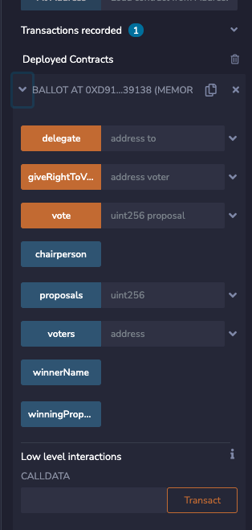

The orange or red button is the writing method of the contract, and the transaction needs to be sent to the chain.
Blue is the reading method of the contract.

### 6.3 Link the local project

The files of the default_workspace is stored in the browser's localStorage, and the storage capacity is limited.

Therefore, it is recommended to link to a local existing project directory for use.

First, install the required npm packages globally:

`yarn global add @remix-project/remixd`

Execute in the local project directory:

`remixd -s`

You can start listening monitor in the local directory. When you start this command, you need online network. So if the network is not good, you need to wait for a while. After the startup is successful, you can see the following output information:

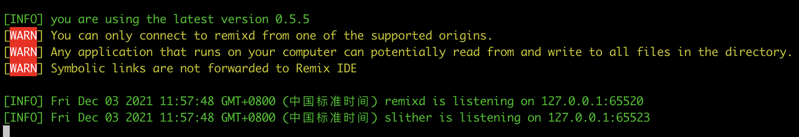


At this point, select `- connect` to localhost in the workspace drop-down box of Remix to link to the local directory.

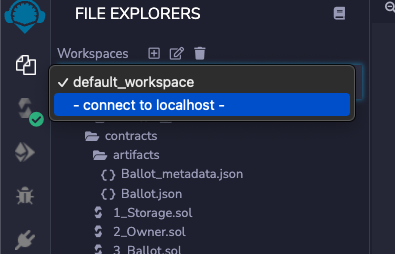

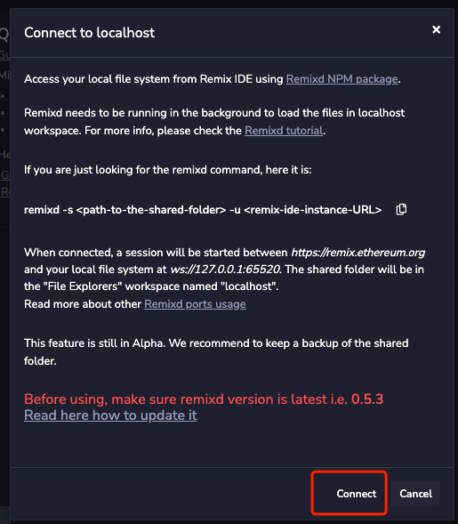

After the connection is successful, you can see the local directory structure in the left window, and you select the contract to compile and deploy.

### 6.4 Debug Transactions

The Debuger can be activated in the plugin manager on the left:

After activation, you can enter the transaction address in the debugging window on the left to debug the transaction.

When the locally compiled bytescode is the same as the transaction contract, Remix will automatically find the source code file for display.

At present, Ethereum can be debugged, but there are still compatibility problems in wanchain debugging, and it is necessary to wait for the ongoing Wanchian EMV upgrade.

### 6.5 FAQ

- It prompts that the debug_traceTransaction interface cannot be found when I debug. What should I do?

You can try linking the Web3 Provider on the compile page for debugging. It maybe results from Remix or RPC does not support the debug API.

- Can I use Wanchain directly?

To deploy and use the Wanchain contracts, the eVM version must be set to Byzantium at present.

- There is no response on the interface.

Refresh the webpage and try it again.

- The contract codes are missing

You can link to the local directory. The reason is that the browser storage space is insufficient.

- Does it support direct import the @openzeppelin library?

The latest version is supported by default and can be downloaded automatically when compiling. If you need an early version (< 0.8.0), you need to install it locally and link to the local directory for use.

- How to flatten the contract?

For the latest version of solidity contracts, the Truffle-flattener tool cannot be used. You can install Flattener plugin.

